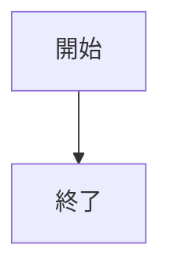
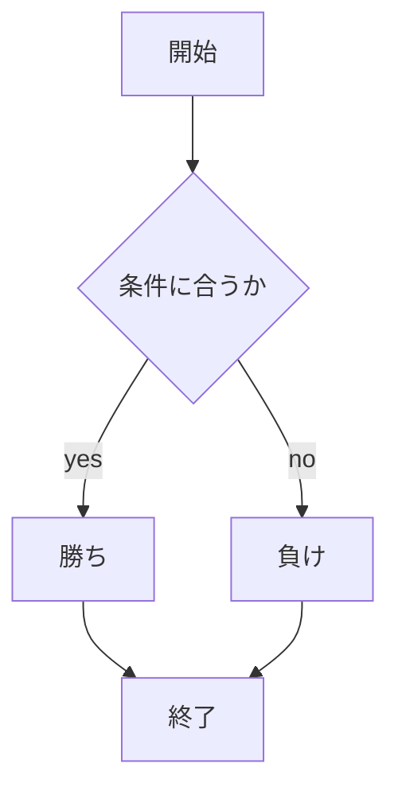

# webpro_06

# app5.jsのドキュメント
## 起動方法
node.jsとnpmがインストールされていることを確認し,ターミナルでapp5.jsが存在するディレクトリまで行き```node app5.js```を実行することでサーバを起動する.
その後,ブラウザでhttp://localhost:8080/public/~.html にアクセスすることで指定したアプリケーションの機能を利用することができる.

## Githubでのファイルの修正・追加
Githubに修正・追加したファイルをアップロードするにはターミナルで以下のコマンドを順に実行する.
```
git add .
git commit -am'変更'
git push
トークン名
```

## ファイル一覧
ファイル名|説明
-|-
app5.js　|　プログラム本体
public/Apple_logo_black.svg | アイコン画像表示の開始画面
views/icon.ejs | アイコン画像表示のテンプレートファイル |
pubkic/luck.ejs | 運勢占いのプログラム |
public/janken.html | じゃんけんの開始画面
views/janken.ejs | プログラムのテンプレート
public/number.html | 数当てゲームの開始画面
views/number.ejs | プログラムのテンプレート
public/rpll.html | サイコロゲームの開始画面
views/roll.ejs | プログラムのテンプレート

## 機能ごとの説明と使用手順
### アイコン画像表示
サーバを立ち上げ,ブラウザでhttp://localhost:8080/public/Apple_logo_black.svg にアクセスするとAppleのロゴマークの画像が表示される.


### じゃんけん
サーバを立ち上げ,ブラウザでhttp://localhost:8080/public/janken.html にアクセスし,「グー」「チョキ」「パー」のいずれかを入力画面に入力する.そうすると,コンピュータの出した手に対しての勝ち負けの判定が表示される.また,何戦中何勝したかというデータも表示される.

### 数字当てゲーム
サーバを立ち上げ,ブラウザでhttp://localhost:8080/public/number.html にアクセスすると「1から100までの数字を入力してください」と言う文字の横に数字を入力する画面が表示される.そこに数字を適当に入力すると,コンピュータが指定した数字よりも高いか低いかの判定を出してくれる.そのやりとりを繰り返してコンピュータが指定した数字を当てると言うゲームである.

### サイコロゲーム
サーバを立ち上げ,ブラウザでhttp://localhost:8080/public/roll.html にアクセスすると「1から6までの数字を予想してください」という文字の横に数字を入力する画面が表示される.そこに適当な数字を入力すると,コンピュータが降ったサイコロの目と自分の予想した数字の目が合っているかを判定してくれる.

```javascript
console.log("Hello");
```

1. ```node app5.js```を起動する
1. Webブラウザでlocalhost:8080/public/janken.htmlにアクセスする
1. 自分の手を入力する






